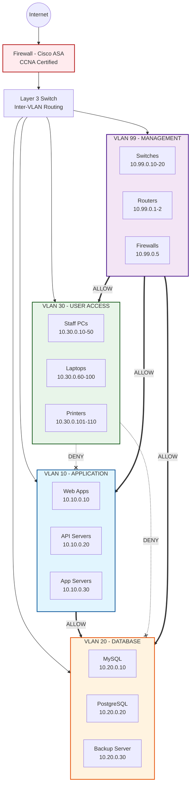

## Network Segmentation Diagram

Here is the network segmentation diagram showing VLANs and ACL rules:

```mermaid
```mermaid
flowchart TD
    Internet((Internet)) --> FW[Firewall - Cisco ASA<br/>CCNA Certified]
    
    FW --> L3[Layer 3 Switch<br/>Inter-VLAN Routing]
    
    L3 --> V10[VLAN 10<br/>APPLICATION<br/>10.10.0.0/24]
    L3 --> V20[VLAN 20<br/>DATABASE<br/>10.20.0.0/24]
    L3 --> V30[VLAN 30<br/>USER ACCESS<br/>10.30.0.0/24]
    L3 --> V99[VLAN 99<br/>MANAGEMENT<br/>10.99.0.0/24]
    
    subgraph V10 [VLAN 10 - APPLICATION]
        direction LR
        Web[Web Apps<br/>10.10.0.10]
        API[API Servers<br/>10.10.0.20]
        App[App Servers<br/>10.10.0.30]
    end
    
    subgraph V20 [VLAN 20 - DATABASE]
        direction LR
        MySQL[MySQL<br/>10.20.0.10]
        PG[PostgreSQL<br/>10.20.0.20]
        BackupDB[Backup Server<br/>10.20.0.30]
    end
    
    subgraph V30 [VLAN 30 - USER ACCESS]
        direction LR
        Staff[Staff PCs<br/>10.30.0.10-50]
        Laptops[Laptops<br/>10.30.0.60-100]
        Printers[Printers<br/>10.30.0.101-110]
    end
    
    subgraph V99 [VLAN 99 - MANAGEMENT]
        direction LR
        Switches[Switches<br/>10.99.0.10-20]
        Routers[Routers<br/>10.99.0.1-2]
        MgmtFW[Firewalls<br/>10.99.0.5]
    end
    
    %% ACL Rules Visualization
    V10 ==>|ALLOW| V20
    V30 -.-x|DENY| V10
    V30 -.-x|DENY| V20
    V99 ==>|ALLOW| V10
    V99 ==>|ALLOW| V20
    V99 ==>|ALLOW| V30
    
    %% Styling
    style V10 fill:#e1f5fe,stroke:#01579b,stroke-width:2px
    style V20 fill:#fff3e0,stroke:#e65100,stroke-width:2px
    style V30 fill:#e8f5e9,stroke:#1b5e20,stroke-width:2px
    style V99 fill:#f3e5f5,stroke:#4a148c,stroke-width:2px
    style FW fill:#ffebee,stroke:#b71c1c,stroke-width:2px
```
