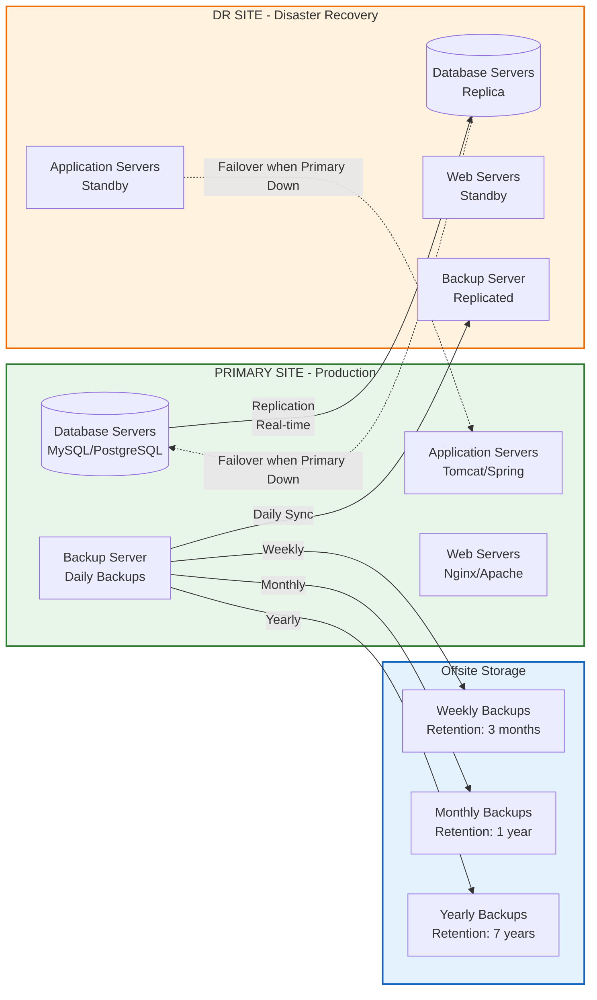

---

## 11-backup-recovery/README.md

```markdown
# 11-backup-recovery

## Purpose
Comprehensive backup procedures, disaster recovery testing methodologies, and automated failover scripts to ensure business continuity.

## Files

| File | Description | When to Use |
|------|-------------|-------------|
| `backup-procedure.md` | Step-by-step backup procedure documentation | Daily/weekly backup operations |
| `recovery-test-procedure.md` | Recovery testing methodology and checklist | Quarterly DR testing |
| `dr-failover-script.sh` | Automated disaster recovery failover script | During DR events or tests |

## Backup Strategy Overview
┌─────────────────────────────────────────────────────────────┐
│ BACKUP STRATEGY │
├───────────────┬─────────────────┬───────────────────────────┤
│ Type │ Frequency │ Retention │
├───────────────┼─────────────────┼───────────────────────────┤
│ Daily │ Every 24 hours │ 30 days │
├───────────────┼─────────────────┼───────────────────────────┤
│ Weekly │ Every Sunday │ 3 months │
├───────────────┼─────────────────┼───────────────────────────┤
│ Monthly │ 1st of month │ 12 months (1 year) │
├───────────────┼─────────────────┼───────────────────────────┤
│ Yearly │ January 1 │ 7 years (for compliance) │
└───────────────┴─────────────────┴───────────────────────────┘

## RTO and RPO Targets

| Environment | RTO (Recovery Time Objective) | RPO (Recovery Point Objective) |
|-------------|-------------------------------|-------------------------------|
| Production | 4 hours | 15 minutes |
| DR Site | 8 hours | 1 hour |
| Development | 24 hours | 24 hours |

## Quick Setup Guide

### 1. Configure Backup Script
```bash
# Edit backup script variables
sudo nano backup-automation.sh

# Modify these lines:
BACKUP_DIR="/backup"           # Change to your backup location
RETENTION_DAYS=30              # Adjust retention policy
DB_PASSWORD="your_password"    # Set database password




